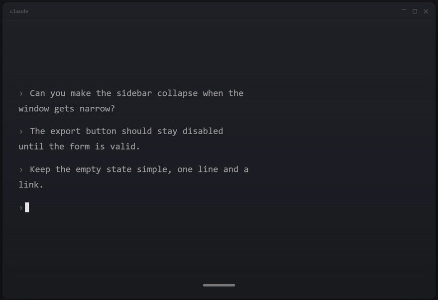
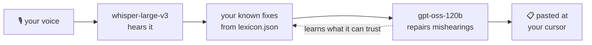
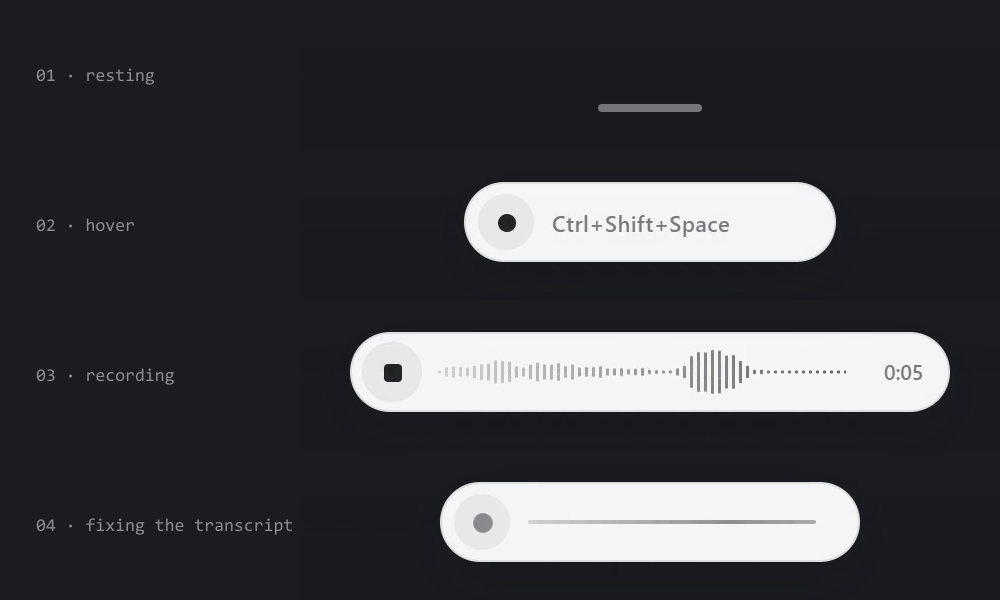

# FlowVoice

Tap a key, talk, tap it again. Your words land wherever your cursor is: a terminal, Claude Code, a chat box, an email.



<sub>The sentence in the demo was written for the demo. The waveform is real measured loudness; no real dictation is shown.</sub>

It runs on Groq's free tier, so one person dictating all day costs nothing. It also learns the words your accent gets wrong, so the same mistake doesn't come back.

Windows only for now.

## Why it exists

Speech to text is great until you have an accent. Whisper kept writing "Claw" when I said Claude and "Spice Nemo" when I said voice memo. Fixing that by hand every time defeats the point of talking. So FlowVoice runs a second pass that repairs the transcript, and it remembers every repair it can trust.

## How it works





- **Hearing:** `whisper-large-v3` on Groq, not the turbo model. Turbo is faster and noticeably worse on accents.
- **Known fixes:** mishearings you've had before are swapped in code, before any model sees the text. Putting them in the prompt made the model over-apply them.
- **Repair:** `openai/gpt-oss-120b` on Groq reads the transcript with your glossary and fixes only what was clearly misheard. It never answers, summarises or rewrites you. If it fails or times out, you get the raw transcript, never something worse.
- **Learning:** a fix is remembered only if the corrected word is in your glossary **and** it actually sounds like what was transcribed. That second check stops the model's guesses from becoming rules.

## Setup

You need Windows 10 or 11, [Node.js](https://nodejs.org) 20 or newer, and a free [Groq API key](https://console.groq.com/keys).

```bash
git clone https://github.com/edotheDev/flowvoice.git
cd flowvoice
npm install
```

Give it your key, either as an environment variable:

```powershell
setx FLOWVOICE_GROQ_KEY "your-key-here"
```

(open a new terminal afterwards so it picks it up), or in the settings file. Run the app once, then right-click the tray icon, pick **Edit settings…** and put the key in `stt.apiKey`.

Then start it:

```bash
npm start
```

A thin pill sits at the bottom of your screen, and the app lives in the tray.

## Keys

| Key | What it does |
|---|---|
| `Ctrl+Shift+Space` | start talking, press again to stop and paste |
| `Esc` | cancel the current recording |
| `Ctrl+Shift+M` | record a voice memo (saved, never pasted) |

You can also click the pill to start.

## Make it yours

Everything lives in `%APPDATA%\flowvoice\config.json` (tray: **Edit settings…**).

- **`correction.glossary`** is the most important setting. Put in the names you actually say: your product, your tools, your teammates. Only words you say out loud. Anything else just gives the model something wrong to reach for.
- **`stt.prompt`** takes the same names, comma separated, to nudge Whisper before the repair pass.
- **`hotkey`** and **`memo.hotkey`** change the keys.
- **`pill.autoInsert: false`** shows the text in the pill first, and waits for a confirm before pasting.
- **`stt.provider`** also accepts `openai`, `elevenlabs` or `deepgram` for the hearing step. The repair step always uses Groq.

What it has learned about your voice is in `%APPDATA%\flowvoice\lexicon.json`, sorted by how often each mishearing happens. Delete an entry to make it forget one.

## Privacy

- Your audio goes to Groq to be transcribed. The transcript goes to Groq once more for the repair pass. Nothing is sent anywhere else.
- Voice memos are saved on your machine and never uploaded when you record them. They're only transcribed when you choose **Transcribe memos** in the tray.
- There's an optional local archive of every dictation (`corpus.enabled`), useful for measuring accuracy over time. It's **off** by default, because it's a recording of everything you say.
- Your key and settings stay in your user profile, never in this folder.

## Status

This is the voice half of a tool I use every day. Before FlowVoice it was called Glass Desk, and [its page is here](https://dotsstudio.io/lab/glass-desk). It runs from source; there's no installer yet. Issues and pull requests are welcome.

## License

MIT
